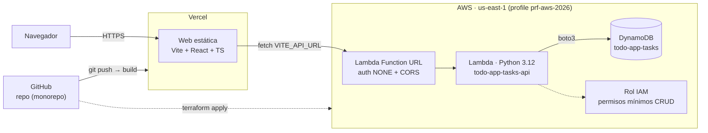

# Lista de tareas — Lambda + DynamoDB + Vite

> **Proyecto cerrado (2026-07-27).** La infraestructura de AWS (Lambda,
> DynamoDB, IAM) fue destruida con `terraform destroy -auto-approve` y ya
> no existe. El frontend en Vercel sigue publicado como referencia estática
> del resultado final, pero no puede leer/crear tareas porque el backend ya
> no está desplegado. Ver §7 de [`PLAN.md`](./PLAN.md) para el detalle del
> cierre y cómo volver a levantar todo desde cero.

Aplicación de lista de tareas (to-do list) con backend serverless en AWS
(Lambda + DynamoDB, gestionado con Terraform) y frontend en Vite + React +
TypeScript, publicado en Vercel.

- **Web en producción** (frontend estático, backend apagado): https://todo-app-lambda-vite.vercel.app
- **API (Lambda Function URL)**: destruida, ya no existe
- **Repositorio**: https://github.com/RECCHIMUZZI/b1-1-4-50-aws-lambda-vite (también en GitLab: https://gitlab.codecrypto.academy/daniel.recchimuzzi/1.4.50-aws-lambda-vite)

Ver también [`PLAN.md`](./PLAN.md) para el detalle completo del proceso,
decisiones y problemas resueltos durante la construcción, y
[`PROMPT.md`](./PROMPT.md) para la especificación original.

## Arquitectura



Flujo de una petición: el navegador carga la SPA servida por Vercel: esta
hace `fetch` directo a la Lambda Function URL (sin API Gateway); la Lambda
valida la petición y hace CRUD sobre DynamoDB con boto3; la respuesta viaja
de vuelta con los headers CORS que agrega la propia Function URL.

## Estructura del repositorio

```
.
├── terraform/     # Infraestructura como código (DynamoDB, Lambda, IAM, Function URL)
├── lambda/        # Código Python de la Lambda (handler.py)
├── web/           # Frontend Vite + React + TypeScript
├── PROMPT.md      # Especificación original del proyecto
└── PLAN.md        # Plan, decisiones y bitácora de implementación
```

## Requisitos previos

- [Terraform](https://developer.hashicorp.com/terraform) >= 1.5
- [AWS CLI](https://aws.amazon.com/cli/) configurado con un profile llamado
  `prf-aws-2026` (`aws configure --profile prf-aws-2026`) con permisos para
  crear recursos de DynamoDB, IAM y Lambda.
- Node.js >= 20 y npm.
- [GitHub CLI](https://cli.github.com/) (`gh`) autenticado, si se va a
  publicar el repo.
- [Vercel CLI](https://vercel.com/docs/cli) (se puede usar vía `npx vercel`
  sin instalación global), si se va a desplegar el frontend.

## 1. Desplegar la infraestructura (Terraform)

```bash
cd terraform
terraform init
terraform apply -auto-approve
```

Esto crea:
- Una tabla DynamoDB `todo-app-tasks` (`PAY_PER_REQUEST`).
- Un rol IAM con permisos mínimos (`GetItem`, `PutItem`, `UpdateItem`,
  `DeleteItem`, `Scan` sobre esa tabla, más logs de CloudWatch).
- La función Lambda `todo-app-tasks-api` (Python 3.12) empaquetada
  automáticamente desde `../lambda/handler.py`.
- Una Function URL pública (`authorization_type = NONE`) con CORS
  habilitado.

Al terminar, Terraform imprime dos outputs:

```bash
terraform output lambda_function_url
terraform output dynamodb_table_name
```

Guarda la URL de `lambda_function_url`: se usa como `VITE_API_URL` del
frontend.

### Probar la API desplegada

```bash
URL=$(terraform output -raw lambda_function_url)

# Crear una tarea
curl -X POST "$URL/tasks" -H "Content-Type: application/json" \
  -d '{"title":"Comprar leche"}'

# Listar tareas
curl "$URL/tasks"

# Marcar como completada (reemplaza {id})
curl -X PUT "$URL/tasks/{id}" -H "Content-Type: application/json" \
  -d '{"completed":true}'

# Eliminar
curl -X DELETE "$URL/tasks/{id}"
```

### Destruir la infraestructura

```bash
cd terraform
terraform destroy -auto-approve
```

## 2. Desarrollar el frontend localmente

```bash
cd web
npm install
cp .env.example .env
# Edita .env y pon la lambda_function_url del paso anterior en VITE_API_URL
npm run dev
```

Abre `http://localhost:5173`. Scripts disponibles:

| Script            | Descripción                              |
|-------------------|-------------------------------------------|
| `npm run dev`     | Servidor de desarrollo con hot-reload.     |
| `npm run build`   | Type-check (`tsc -b`) + build de producción a `dist/`. |
| `npm run preview` | Sirve el build de producción localmente.   |
| `npm run lint`    | Lint con oxlint.                           |

## 3. Publicar en GitHub

```bash
git init            # si el repo aún no existe
git add -A
git commit -m "mensaje"
gh repo create <nombre> --public --source=. --remote=origin --push
```

## 4. Desplegar el frontend en Vercel

```bash
cd web
npx vercel login          # una sola vez, abre un flujo de autenticación por navegador
npx vercel link           # vincula/crea el proyecto en Vercel
npx vercel env add VITE_API_URL production   # pega la lambda_function_url
npx vercel env add VITE_API_URL preview      # idem, para deploys de preview
npx vercel --prod         # build + deploy a producción
```

Cada `git push` a la rama conectada genera automáticamente un deploy de
preview si se conecta el repo de GitHub al proyecto de Vercel desde el
dashboard (Project Settings → Git).

## Notas y problemas conocidos

Ver la sección "Gotchas" de [`PLAN.md`](./PLAN.md) para el detalle de dos
problemas no obvios ya resueltos en este código:
- La Function URL requiere **dos** permisos (`InvokeFunctionUrl` +
  `InvokeFunction`) desde octubre de 2025, o responde `403 Forbidden`.
- El CORS debe configurarse solo en la Function URL, nunca también en el
  código de la Lambda, o el navegador rechaza la respuesta por headers
  `Access-Control-Allow-Origin` duplicados.
